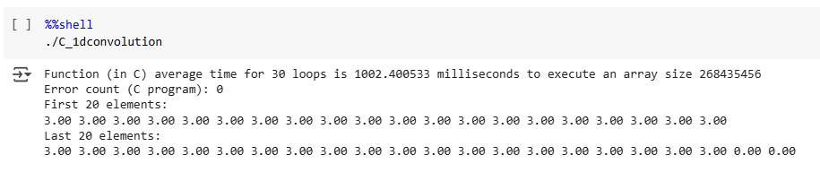
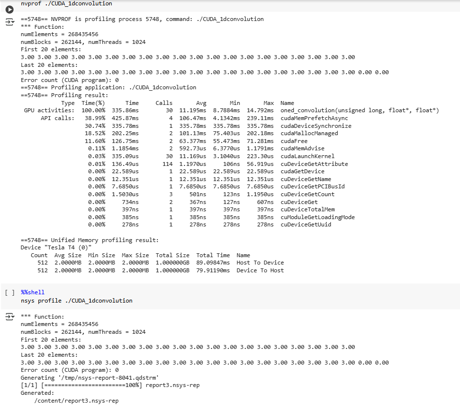
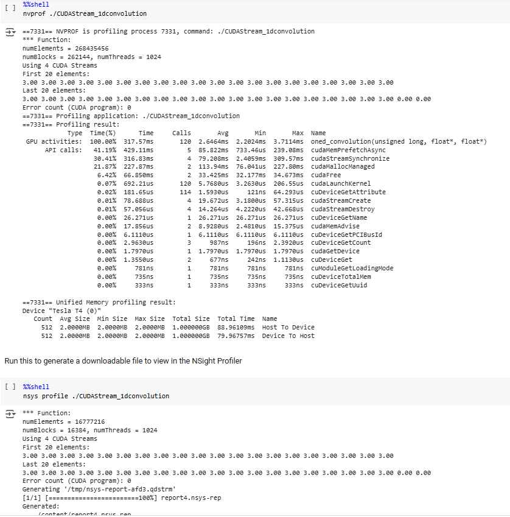
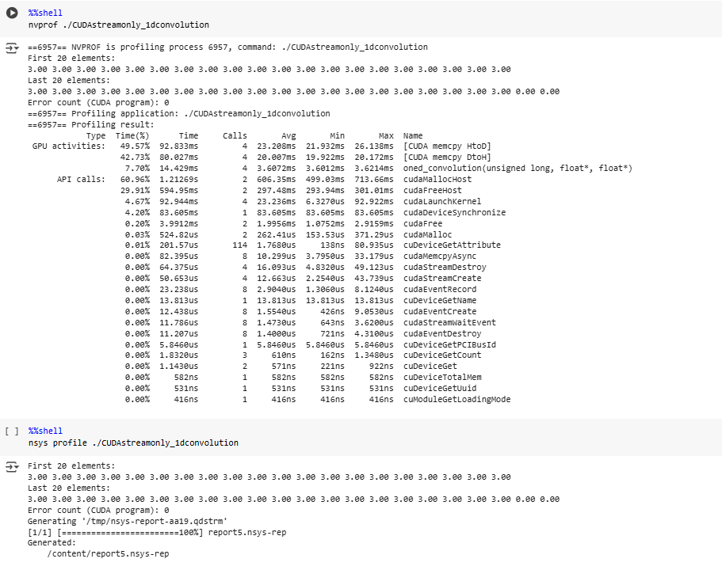
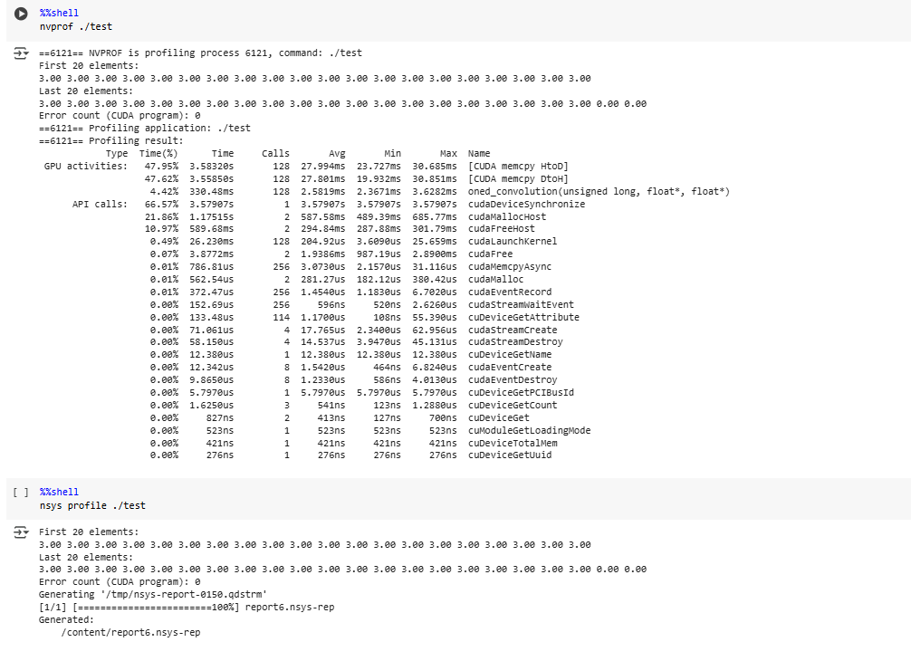
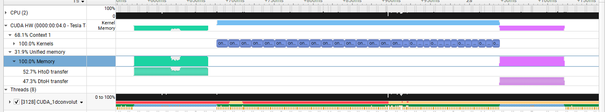
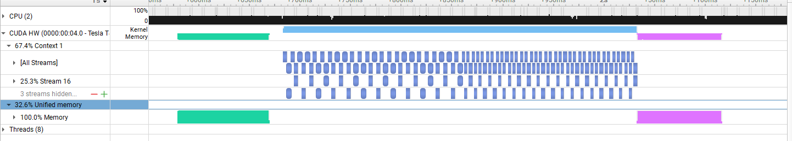
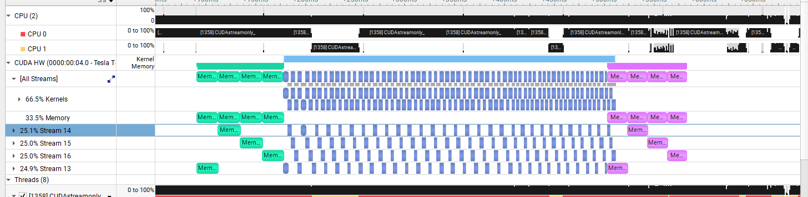
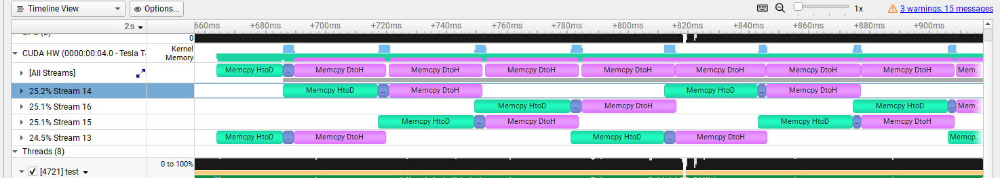

# CEPARCO GPU PROJECT

## Overview
This project implements and benchmarks 1D convolution computation on a single input signal (array) using: C, CUDA. The execution time of each implementation is recorded and analyzed for performance comparison.

## Colab Link
- https://colab.research.google.com/drive/1cr4kM2cROON08fjmTapcvzKTbSEsDspZ?usp=sharing

## Video Recording

## Project Structure
### (1) C Program 
- Contains the C implementation of the 1D convolution computation
- Computes the correctness of the results and outputs onto console
- Used as a reference for correct output
### (2) CUDA (with prefetching, mem advse, and unified memory)
- Standard CUDA implementation 
- Since this was already proven to be faster than C, this will be used as the benchmark
### (3) CUDA with streams (with prefetching, mem adivse, and unified memory)
- Each kernel call of 1dconvolution function is divided into 4 streams
- Data is prefetched before and after
### (4) CUDA with streams and memcpy (no prefetching, mem advise, or unified memory)
- Data was memcpy'd once from host to device before the kernel calls and once after device to host
### (5) CUDA with streams and memcpy for each loope (no prefetching, mem advise, or unified memory)
- Memcpy from host to device was done before every kernel call while device to host was done after every kernel

## Screenshots of the Program Output with Execution Time and Correctness Check

- Figure 1: Screenshot of C Output with Execution Time and Correctness Check


-  Figure 2: Screenshot of CUDA Output with Execution Time and Correctness Check


-  Figure 3: Screenshot of CUDA (with streams) Output with Execution Time and Correctness Check


-  Figure 4: Screenshot of CUDA (with streams and memcpy) Output with Execution Time and Correctness Check


-  Figure 5: Screenshot of CUDA (with streams and memcpy for each loope) Output with Execution Time and Correctness Check


## Screenshots of the Timeline Viewed through NVIDIA Nsight Systems

-  Figure 6: Timeline of Baseline CUDA
-  

-  Figure 7: Timeline of (3)
-  

-  Figure 8: Timeline of (4)
-  

-  Figure 9: Timeline of (5)
-  

## Comparative Table of Execution Time


## Results and Analysis


<sub>Figure 9: Table of execution comparison for all cases</sub>

We run each test case in both release and debug versions in order to gain a clearer picture of the performance improvements across the different kernels. 
We were not able to run n^30 as a test case due to computer hardware limitations, n^28 was used as a substitute.
### Performance Breakdown
#### C
As expected, C is among the slowest, especially in debug mode, since the way the function is implemented is sequential, meaning that each element is computed one at a time. Creating a program or a function in C is easier compared to the next kernels but the performance will not be as optimized due to the lack of explicit parallelism. Release mode, however, tends to be faster than x86. This may be due to release mode being incredibly optimized for C. 

#### x86
x86 is a bit slower than C in release version due to the function not being optimized enough. Creating a well-optimized x86 assembly program is way more difficult than C but with proper knowledge it should be able to run a bit faster. x86 assembly still uses the same scalar or sequential operations as C which is why not all implementations are faster than the baseline.

#### XMM 
The use of XMM SIMD results in a major performance improvement over scalar C and x86 assembly. This is because XMM registers are able to perform parallel execution, allowing two 64-bit floating-point (double precision) values or four 32-bit floating-point values to be processed simultaneously in a single instruction. In this case, we are able to compute two 64-bit FP values at a time which results in the performance improvement over C and x86.

#### YMM
The fastest implementation in the comparison is YMM SIMD, which extends the SIMD registers to 256 bits. This enables each instruction to process four 64-bit floating-point numbers or eight 32-bit floating-point numbers at once, doubling the throughput of XMM SIMD. This is naturally the best implementation in terms of parallel computing among these kernels because of it being able to compute four 64-bit values at a time compared to XMM's two. 
 
### Implementation of Correctness Check


<sub>Figure 3: Screenshot of correctness check</sub>

The results of the C function were used as a baseline in order to verify the correctness of each kernel. Each of the outputs of each kernel are stored in a double variable in the program as: ```result_c```, ```result_asm```, ```result_xmm```, and ```result_ymm```. The comparison is done with the function: ``` if (fabs(result_c - result_x) < 1e-6) ``` . Since C is assumed as the correct output, by subtracting the result of c to the result of the other kernels and taking the absolute value with a tolerance of ```1e-6``` . The correctness outputs of all test cases may be found in the first section of screenshots.


## Conclusion and Discussion
Throughout the development of the programs there were various <b>AHA!</b> moments. <br><b>For XMM</b>: using ```rsi``` for the ```xmm``` function wasn't an ideal option. In debugging it was functioning as expected. However, when used in the Release version, memory access violations occur. Through discussion with groupmates, it was found that it could be due to which registers are considered volatile or non-volatile. The ```rsi``` register was used as an index for the ```xmm``` register, but since it is non-volatile memory, it should be pushed in stack first before use. The current solution used is to use a volatile register instead: ```r11```. This reduces the need to push and pop from stack. <br><b>For YMM</b>: the most troublesome part was getting it to work with values of n that arent multiples of 4 like ```n = 1,2,3,5,etc``` since the ```ymm``` register pack moves 4 values at a time. when theres not enough elements in memory to exactly fit the ```ymm```, the unoccupied spaces would have garbage values which mess up the computations. The solution to that was to just use a loop to individually add the remaining values to the final output. This was only for the very last few values, the rest of the array was still computed using packed SIMD instructions.

It is also interesting to note how on release mode, C code can actually beat x86 in terms of speed, perhaps due to the optimizations present in this mode as compared to debug mode which has none. 

The performance results aligned with expectation from what the group learned about SIMD registers and operations with the YMM SIMD being the fastest due to its capabilities. The results highlighted the importance memory alignment and data access patterns, when data is misaligned while using SIMD instructions, it won't be able to properly implement its parallelism due to mismatching data. The project allowed the group to explore the capabilities and advantages of using parallel programming for high-performance programs, compared to the usual sequential operations of relatively higher-level programming languages like C.

The strength of the SIMD instructions is highlighted in large datasets like ```2^28``` and beyond. The performance gain of using the ```AVX``` and ```AVX2``` registers cannot be replicated by sequential operations. For small data sets like ```100``` and below, the performance difference between sequential and parallel operations are negligible.
