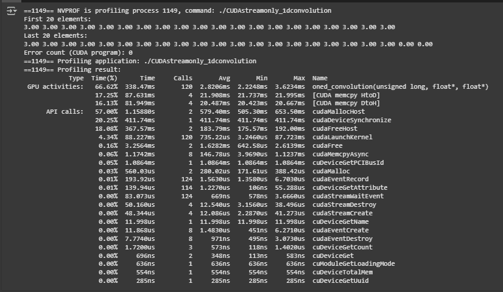

# CEPARCO GPU PROJECT

## Overview
This project implements and benchmarks 1D convolution computation on a single input signal (array) using: C, CUDA. The execution time of each implementation is recorded and analyzed for performance comparison.

## Colab Link
- https://colab.research.google.com/drive/1cr4kM2cROON08fjmTapcvzKTbSEsDspZ?usp=sharing

## Video Recording

## Project Structure
### (1) C Program 
- Contains the C implementation of the 1D convolution computation
- Computes the correctness of the results and outputs onto console
- Used as a reference for correct output
### (2) CUDA (with prefetching, mem advse, and unified memory)
- Standard CUDA implementation 
- Since this was already proven to be faster than C, this will be used as the benchmark
### (3) CUDA with streams (with prefetching, mem adivse, and unified memory)
- Each kernel call of 1dconvolution function is divided into 4 streams
- Data is prefetched before and after
### (4) CUDA with streams and memcpy (no prefetching, mem advise, or unified memory)
- Data was memcpy'd once from host to device before the kernel calls and once after device to host
### (5) CUDA with streams and memcpy for each loope (no prefetching, mem advise, or unified memory)
- Memcpy from host to device was done before every kernel call while device to host was done after every kernel

## Screenshots of the Program Output with Execution Time and Correctness Check

- Figure 1: Screenshot of C Output with Execution Time and Correctness Check


-  Figure 2: Screenshot of CUDA Output with Execution Time and Correctness Check


-  Figure 3: Screenshot of CUDA (with streams) Output with Execution Time and Correctness Check


-  Figure 4: Screenshot of CUDA (with streams and memcpy) Output with Execution Time and Correctness Check


-  Figure 5: Screenshot of CUDA (with streams and memcpy for each loope) Output with Execution Time and Correctness Check


## Screenshots of the Timeline Viewed through NVIDIA Nsight Systems

-  Figure 6: Timeline of Baseline CUDA
-  

-  Figure 7: Timeline of (3)
-  

-  Figure 8: Timeline of (4)
-  

-  Figure 9: Timeline of (5)
-  

## Comparison and Speedup
Speedup is computed as (2)/(X). Includes data transfer times. (X) refers to the Project Structure section of this document. 
- Speedup (2)/(3) : 1.04
- Speedup (2)/(4) : 0.99
- Speedup (2)/(5) : 0.07

- (2) = 335.86 ms + 89.1 ms + 79.91 ms = 504.87 ms
- (3) = 317.57 ms + 88.96 ms + 79.97 ms = 486.5 ms
- (4) = 338.47 ms + 87.63 ms + 81.95 ms = 508.05 ms 
- (5) = 330.48 ms + 3582 ms + 3559 ms = 7471.48 ms

## Results and Analysis

As we can see from the results and speedup computations, all the implementations have more or less the same times except for (5). Streams are like queues of processes and the best way to use them is to allocate memory that is unique to that stream. Similar to pipelining, each stream can execute processes concurrently if each stream uses different resources at a certain point in time. That means that if you allocate memory for a specific stream's use, the CPU or other streams should not be able to access to achieve concurrency. However, due to 1D convolution needing in[i+1] and in[i+2], the problem of 1D convolution makes it inherently improbable to use with streams. Hence why all the stream implementations behave similarly to the benchmark CUDA. 

As for (5), that demonstrates how streams should look like. During the


## Conclusion and Discussion
Throughout the development of the programs there were various <b>AHA!</b> moments. <br><b>For XMM</b>: using ```rsi``` for the ```xmm``` function wasn't an ideal option. In debugging it was functioning as expected. However, when used in the Release version, memory access violations occur. Through discussion with groupmates, it was found that it could be due to which registers are considered volatile or non-volatile. The ```rsi``` register was used as an index for the ```xmm``` register, but since it is non-volatile memory, it should be pushed in stack first before use. The current solution used is to use a volatile register instead: ```r11```. This reduces the need to push and pop from stack. <br><b>For YMM</b>: the most troublesome part was getting it to work with values of n that arent multiples of 4 like ```n = 1,2,3,5,etc``` since the ```ymm``` register pack moves 4 values at a time. when theres not enough elements in memory to exactly fit the ```ymm```, the unoccupied spaces would have garbage values which mess up the computations. The solution to that was to just use a loop to individually add the remaining values to the final output. This was only for the very last few values, the rest of the array was still computed using packed SIMD instructions.

It is also interesting to note how on release mode, C code can actually beat x86 in terms of speed, perhaps due to the optimizations present in this mode as compared to debug mode which has none. 

The performance results aligned with expectation from what the group learned about SIMD registers and operations with the YMM SIMD being the fastest due to its capabilities. The results highlighted the importance memory alignment and data access patterns, when data is misaligned while using SIMD instructions, it won't be able to properly implement its parallelism due to mismatching data. The project allowed the group to explore the capabilities and advantages of using parallel programming for high-performance programs, compared to the usual sequential operations of relatively higher-level programming languages like C.

The strength of the SIMD instructions is highlighted in large datasets like ```2^28``` and beyond. The performance gain of using the ```AVX``` and ```AVX2``` registers cannot be replicated by sequential operations. For small data sets like ```100``` and below, the performance difference between sequential and parallel operations are negligible.
